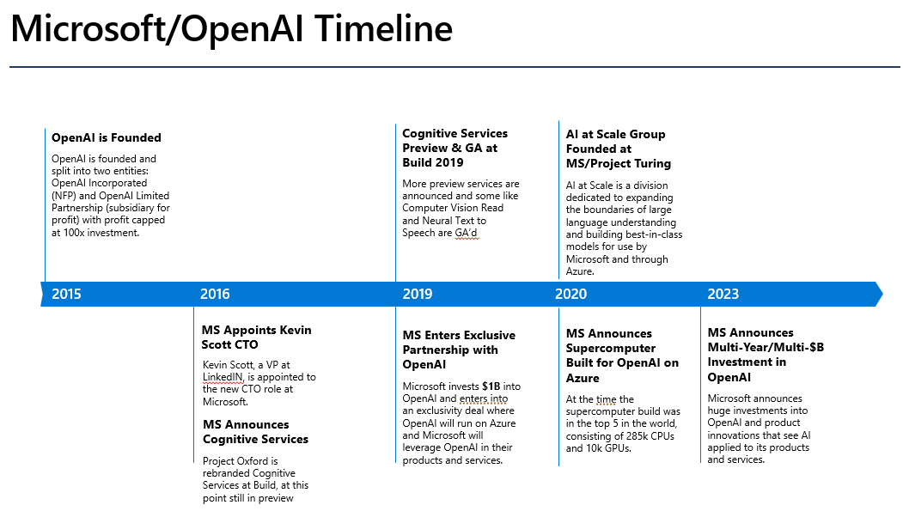

# Microsoft AI Journey Talk Resources
Below are links to resources I shared/mentioned for my Microsoft AI Journey talk. Links will be add/updated/removed over time depending on relevance.

### Satya Quote Source - Dawn of the AI Wars | The Circuit with Emily Chang (Bloomberg Video)
The two Satya quotes I mention in the talk come from this video. While the title is a bit click-baity, the content is fantastic - candid conversations about AI with both Satya and Sam Altman (CEO of OpenAI)

https://www.youtube.com/watch?v=6ydFDwv-n8w

### Microsoft/OpenAI Timeline
Image of the Microsoft/OpenAI timeline.

### History of .NET with Richard Campbell
Fantastic session on the history of .NET by Richard Campbell

https://www.youtube.com/watch?v=h7DzdygieHs

### Microsoft Responsible AI Hub
This is the main hub of information from Microsoft on Responsible AI. Lots of great information here:

https://www.microsoft.com/en-us/ai/responsible-ai

Specifically, this page goes into detail around our Responsible AI Framework (Fairness, Reliability & Safety, Privacy & Security, Inclusiveness, Transparency, Accountability).

https://www.microsoft.com/en-us/ai/principles-and-approach/

This page provides tools and practicies to implement responsible AI in your organization.

https://www.microsoft.com/en-us/ai/tools-practices

### Tools and Weapons
Information on the book Tools and Weapons by Brad Smith, Microsoft President.

https://news.microsoft.com/on-the-issues/tools-and-weapons/

### Copilot Copyright Commitment
Link to the blog post on Microsoft's Copilot Copyright Commitment

https://blogs.microsoft.com/on-the-issues/2023/09/07/copilot-copyright-commitment-ai-legal-concerns/

### Azure AI Links
Below are links to various resources across all the Azure AI offerings

What is Azure Machine Learning?

https://learn.microsoft.com/en-us/azure/machine-learning/overview-what-is-azure-machine-learning?view=azureml-api-2

Choose an Azure Cognitive Services Technology

https://learn.microsoft.com/en-us/azure/architecture/data-guide/technology-choices/cognitive-services

What is Azure OpenAI Service?

https://learn.microsoft.com/en-us/azure/ai-services/openai/overview

### Gartner Hype Cycle
Main page for information on the Gartner Hype Cycle methodology.

https://www.gartner.com/en/research/methodologies/gartner-hype-cycle

### Three Horizon Model
This is one of the best independant articles on the three horizon model I've read. It does a great job explaining the nuances between the horizons and how they intersect.

https://medium.com/activate-the-future/the-three-horizons-of-innovation-and-culture-change-d9681b0e0b0f

